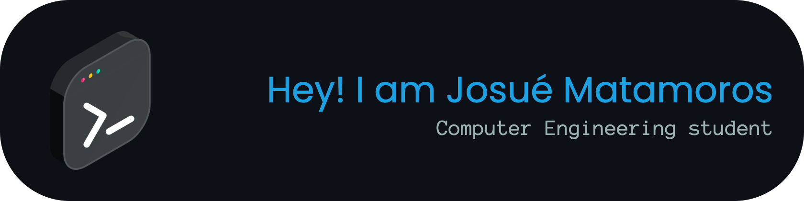

  

# About me

Thank you for visiting my GitHub! I'm a Computer Engineering student from Costa Rica with a strong passion for technology and learning. I love exploring new projects and expanding my skills.

# Tools & Frameworks That I Use

  

# Familiar / Learning

  

# Dev Environment

  

###

<table
  width="100%"
  cellpadding="0"
  cellspacing="0"
  border="0"
  style="border: none; border-collapse: collapse;"
>
  <tr>
    <td align="center" style="border: none;">
      <!-- GitHub Stats -->
      
    </td>
    <td align="center" style="border: none;">
      <!-- Top Languages -->
      
    </td>
  </tr>
  <tr>
    <td style="border: none;">
      <!-- Streak -->
      
    </td>
    <td align="center" style="border: none;">
      <!-- GIF -->
      
    </td>
  </tr>
</table>

# Connect with me

  
  
  
    

